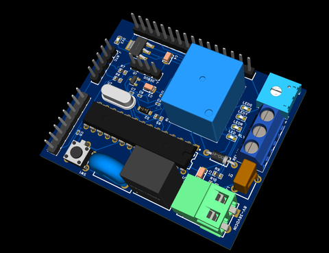

# Feature: RFID Card Reader integrated with multiple verification method (Group Project)

## Contributor: 
|       Name          |              Contact          |
|---------------------|-------------------------------|
| Vo Viet Hung        | https://github.com/hungpio89  |
| Nguyen Van Cuong    |                               |
| Nguyen Dang Quang   | https://github.com/ngdangquang|

## 1. Introduction: 
Update: March 19th, 2025: You are invited to reference - test on the main branch, which is the result of Group Project about RFID mini-project for housing - office. We haven't completed testing this feature yet but we expect it would work. If you do test it, please let me know and I'll adjust and merge it to master.

## 2. Tool used

### 2.1. MicrochipStudio (Version ???)

### 2.2. Altium

## 3. Design and Architecture

## 4. Sample of Design
### 4.1. General flowchart of system operation

- March 22nd, 2025 - Note: This is just a referencing version for system operation (not verified) -> if there is any errors, please don't hesitate to contact us (Contributor).

### 4.2. PCB Design of system

- March 22nd, 2025 - Note: This is the first version of board development without testing -> refer only.

### 4.3. PCB Layout (Figure/Group12_PCB_Layout)

- March 26th, 2025 - Note: This is the first version of board development without testing -> refer only.

### 4.4. Schematic Design of system
[text](RFID_Schematic.pdf)
- March 22nd, 2025 - Note: This is the first version of board development without testing -> refer only.

